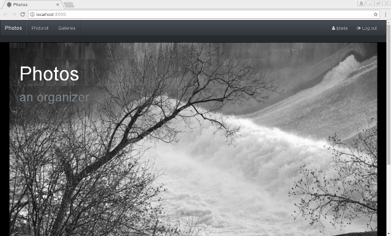
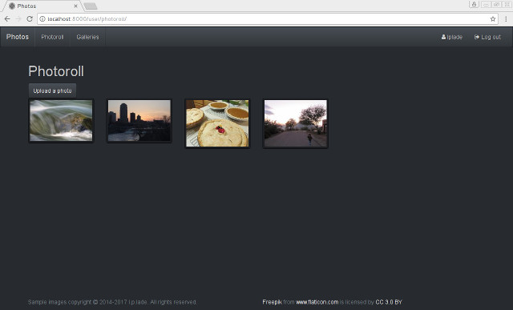
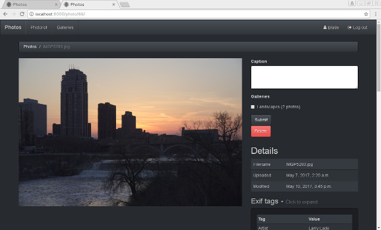
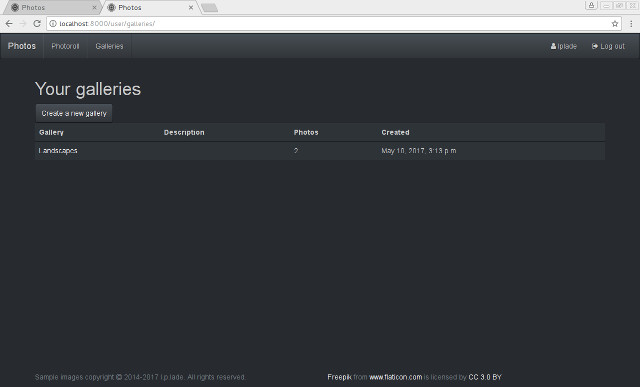

# Photo CMS #

(needs a catchier name)

## Description ##

Web-based photo content management system

[Live demo at AWS](http://photo-cms-dev.us-west-2.elasticbeanstalk.com/)

## Screenshots ##

### Home page ###


### Photoroll ###


### Photo details ###


### List of galleries ###


### Gallery ###


## Requirements ##
* [Python 3.4](https://www.python.org/downloads/release/python-346/)
* [PostgreSQL 9.4+](https://www.postgresql.org/download/) In Debian and 
derivatives, make sure postgresql-contrib is installed, it contains hstore
support
* Pillow dependencies:
    * [libjpeg-dev](http://libjpeg.sourceforge.net/)
    * [libtiff-dev](http://www.libtiff.org/)
    * [zlib1g-dev](http://zlib.net/)
    * [lcms2-dev](http://www.littlecms.com/)

Designed for hosting in AWS Elastic Beanstalk

## Local setup ##
TODO just run setup script
* `pip install -r requirements.txt`
* Install PostgreSQL, run `psql`:
    * `create user photo with password 'xxxx';`
    * `create database photo with owner photo;`
    * For unit testing support ONLY do: (security risk)
        * `alter user photo createdb;` (Needed for unit testing)
        * `alter role photo superuser;` (Use `alter role photo nosuperuser;` when done)
    * Otherwise do:
        * `\c photo`
        * `create extension if not exists hstore;`
* Store password in POSTGRES_PHOTO_PASSWORD environmental variable
    * bash$ `export POSTGRES_PHOTO_PASSWORD='xxxx'`
* Set DJANGO_SECRET_KEY before running. Can generate from Python console with
```
import random
print(''.join([random.SystemRandom().choice('abcdefghijklmnopqrstuvwxyz0123456789!@#$%^&*(-_=+)') for i in range(50)]))
```
* Set DJANGO_DEBUG=1 for debug mode
* `python manage.py migrate`
* `python manage.py collectstatic`
* `python manage.py createsuperuser`
* `python manage.py runserver`
* May need to log in at //localhost/admin first

## TODO ##
* Better UX
    * Merge User and Profile into single form?
* More restrictive user creation (Captcha? Invites?)
* Fine-grained file permissions for sharing files with friends and hiding from public
* Slick JavaScript-based frontend stuff (AngularJS? ReactJS?)
* Re-work to use RESTful API backend
